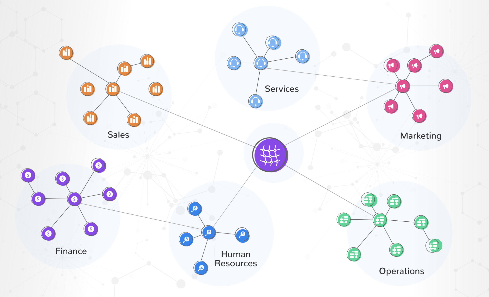

# Data Mesh

* **Data mesh** is an organization design & implementation approach to deploy data platform (e.g data warehouse, data lake, ETL, etc.)
* **Motivation**:
    * "Data is an asset" is a bad thinking, leading to the accumulation of data
    * "Data as a Product" is the new thinking:
        * Real value of data is the value getting from business
        * Data must have the owner from business for the end-to-end responsibility, not the Data team

* **Data mesh principles**:
    1. Business value (Goal)
    2. Business domains (Context)
    3. Distributed responsibility (a team of IT and Business people, ideally 6-8 and max 12 members per team) 
### Good practices

* Build decentralized data model (de-monolith), typically 1 schema per business domain
* Overall with Data Governance practices, e.g consistent primary key - foreign key relationships, naming convention, typing convention. Therefore, the schemas of distinct products could be connected with each other later.  
* Make it easy for business (e.g semantic layer, data dictionaries), else they will not use it 

### Other interesting bits from the conference
* Data is like water. If the water does not come with high quality, you might not want to ingest it.
* Better to move the data processing to where data is, as moving data around (i.e to the processing place) is not good practice 