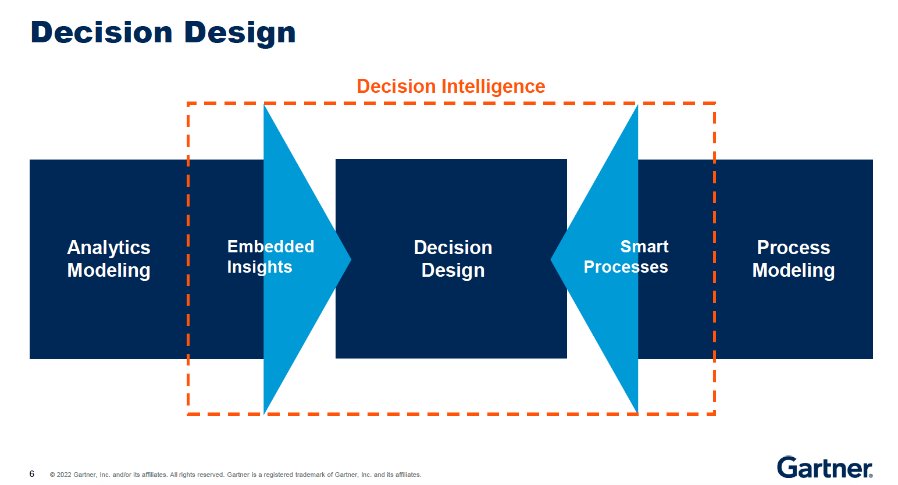
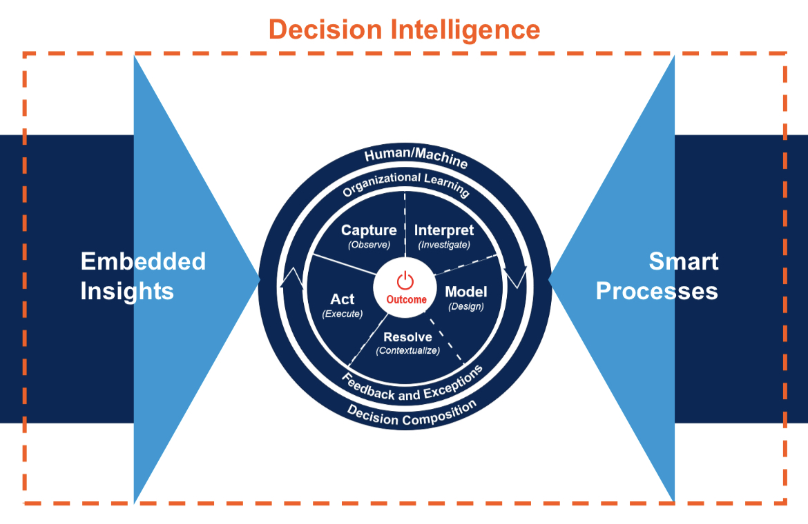
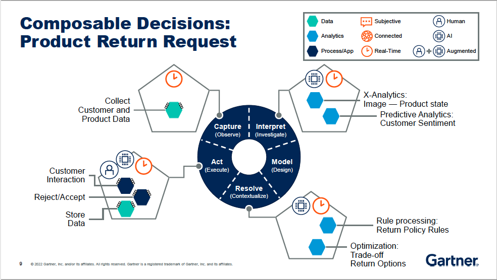
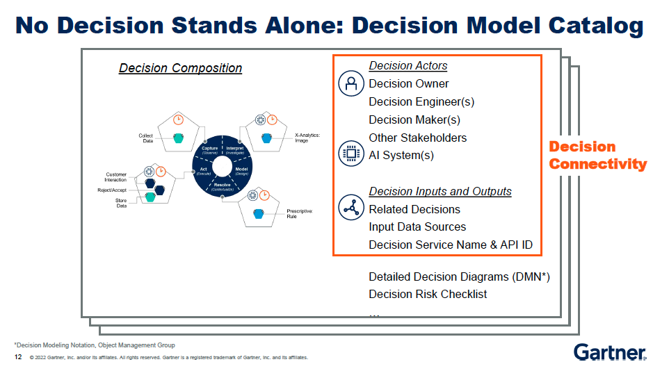
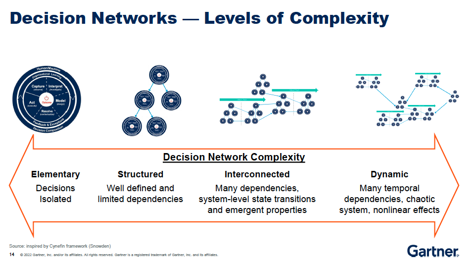
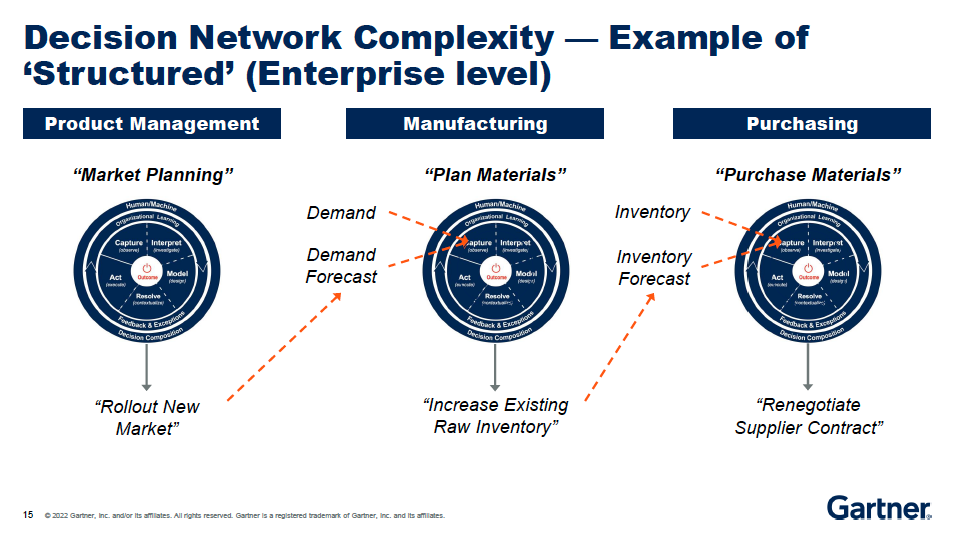
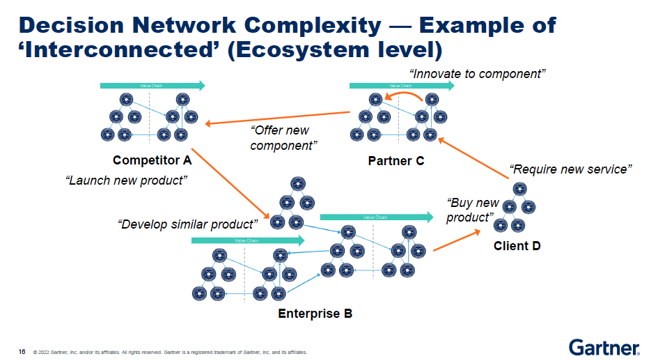
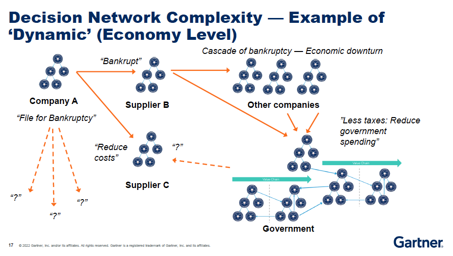
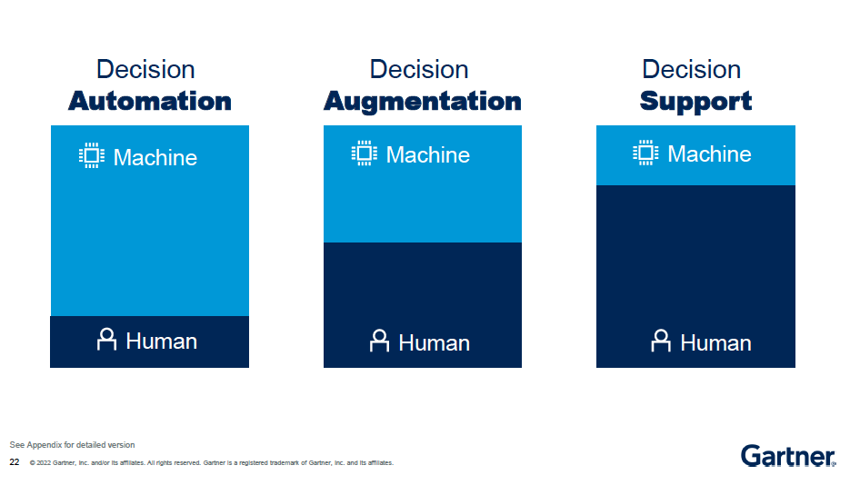
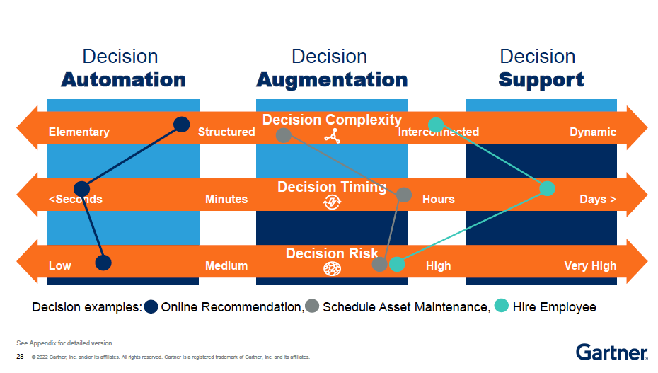

# Takeaways: Decision Intelligence

> Source: Gartner Data & Analytics Summit 2022

## 1 - Decision modeling

**Takeaways**
1. Begin by identifying and modeling your most critical decision
2. Decompose each decision
3. Apply analytical techniques for optimization

## 2 - Decision networks

> Create the decision model catalog, to capture key decision metadata (context, interdependencies)

Three key elements
- Real-world situation and events (data)
- Decision actors / stakeholders
- Connected decision graph (Decision network)

> Analyze the complexity of decision network (graph technology) to choose the decision support/augmentation/automation

> Examples

**Takeaways**
> Make your decision networks explicit to identify interdependencies for further optimize decision-making

Understanding decision networks is business critical

- Balance local incentives and enterprise/eco-system goals
- Improve the entire journey
- Stakeholder involvement
- Resolve bottlenecks
- Improve decision risk management

## 3 - Optimize decision: Support-Augmentation-Automation

> Do we really need to "data-driven" everything?

Decision are driven by different factors, and best when blended. Data is one element not the only one:

- **Rational**: data-driven
- **Collaborative**: mutual agree / voting
- **Principle** (rules)
- **Instinctive**: gut feeling, emotions, experiences

Human/Machine hybrid for decision-making:

- Decision support: Human decided what analysis/reports to use, use as information to make decisions
- Decision augmentation: Machine suggests, human decide to accept/reject (approve)
- Decision automation: Machine acts, human routinely review later

1. **Decision complexity**: elementary, structured (Auto) - dynamic, interconnected (Support)
2. **Decision timing**: second (Auto) - days (Support)
3. **Decision risk**: low (Auto) - high (Very high)

**Takeaways**

> Determine the right level of automation in decision-making by applying the key criteria of timing, complexity and risk.

## Recaps

1. Optimize decisions by composing decision intelligence solutions from predictive, prescriptive or other analytics bulding blocks
2. Create decision model catalog, capturing of key decision metadata (context, interdependencies)
3. Analyze the complexity of decision network (graph technology) to choose the decision support/augmentation/automation