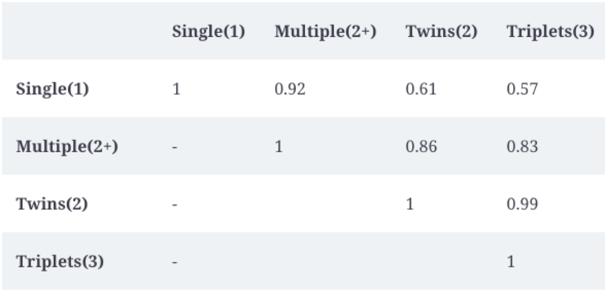

# Data representation

> Transforming the original cols (=> feats)
Mostly for the purpose of model performance, though sometimes it also might work for the DA.
[Deepnote](https://deepnote.com/workspace/anh-dang-f863ca62-663a-4711-b2e1-21424b6f99ca/project/ml-design-patterns-75172c78-11b7-4c93-8c50-a4293114547c/%252F02_data_representation%252Fsimple_data_representation.ipynb)
- Doing the scaling (linear transform) by BigQuery SQL
- (Skewed distribution) Doing the non-linear transform (bucketize, boxcar, root, log) by BigQuery SQL → **Desire: Bell-curve shape / uniform distribution**
	- Log: convert non-linear to linear (reverse of exp)
	- Root: scale down the range (also distance between data point) → combine with `round` similar effect as binning (higher root: lower number of bins)
	- Bucketize: by percentiles → histogram equalization, bins are chosen by the quantiles of the raw distribution (output range: [0, 100] for 100 percentiles) 
	- Boxcox
		- Heteroscedasticity: variance is smaller for smaller range of values, and higher for higher range of values
		- Parametric transformation: `lambda` (control variance, not depends on magnitude) -  To normalize across the all ranges of value
---
> How to handle categorical variables?
> 
## Embedding
> High-cardinality → Low-dim

- 
- Another hidden layer of the NN → Vector embeddings represent the most efficient low-dimensional representation of those feature values
    - One-hot encoding: Not reflect the "similarity" between different cardinality. Treat 2 categories as **separate and unrelated**
    - Learned embedding: allows us to extract inherent similarities between two separate categories. Able to generalize well with less of a manual feature engineering burden
    - Transfer learning: use pre-trained embeddings when training a separate ML model
> Example: Birth plurality → By forcing categorical variable into a lower-dimensional embedding space, we can also learn relationship between the different categories

> Example: Recommendation (customer x video)

- Trade-off:
    - Compromised representation (loss of information) → **Choose the large or small embedding dimension**?
    - Rule of thumbs: 
        - root 4th of total number of unique categorical elements 
        - 1.6 times the square root
        - 625 unique values → 5-40
> Embedding (pre-trained) could be use for downstream

**Autoencoder**
- Use all the unlabeled data to go from high-cardinality to lower cardinality = auto encoder (auxiliary learning task)
- Less labeled data to solve classification problem (only need to learn from the lower-dimension setting)

**Word2Vec:** embedding, using shallow NN and combine CBOW and skip-gram → Learn low-dimensional embeddings that best capture the context of words
- Capture the semantic relationship between words → In embedding space, the vector representation maintain meaningful distance and directionality
- Word embeddings are same, regardless of the sentence and word

BERT: masked language model (randomly mask words from text and the model guesses what the missing words are). Next sentence prediction is a classification task where the model predicts whether or not two sentences followed each other in the original text
- Contextual, embedding vector is different depending on the context where the word is used

## Feature Cross
While adding extra layers to a DNN could potentially provide enough nonlinearity to learn how pairs behave → This drastically increases the training time. 
Doing feature cross (linear regression) perform comparably and train faster.
- No feature cross for continuous (bucketize → feature-cross)
- Not cross 2 highly-correlated  (does not bring any new information to the model)
- Sparse feature cross → Embedding (lower-dimensional)
- Regularization

## Multimodal
- Feed different types of data into model (images/text)

1. Combine numeric and categorical
2. Text: embedding → Flatten to concatenate with (1)