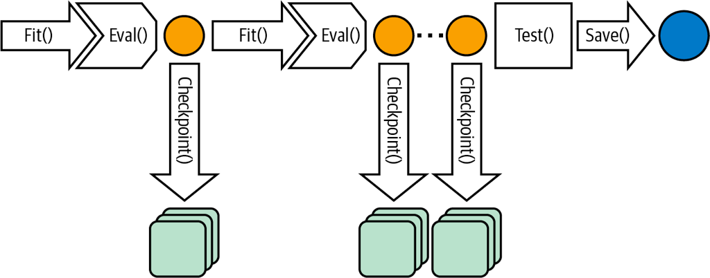
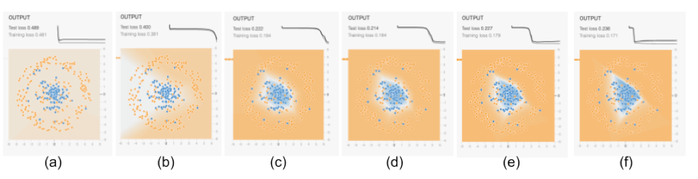
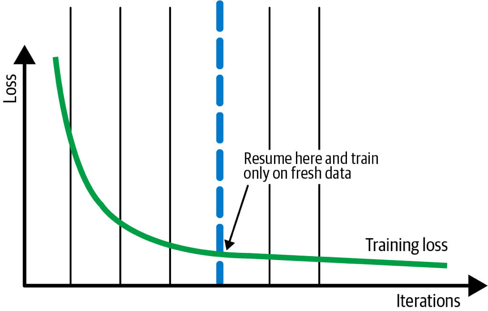
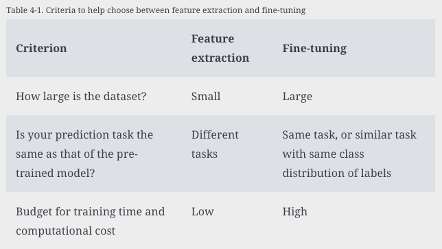
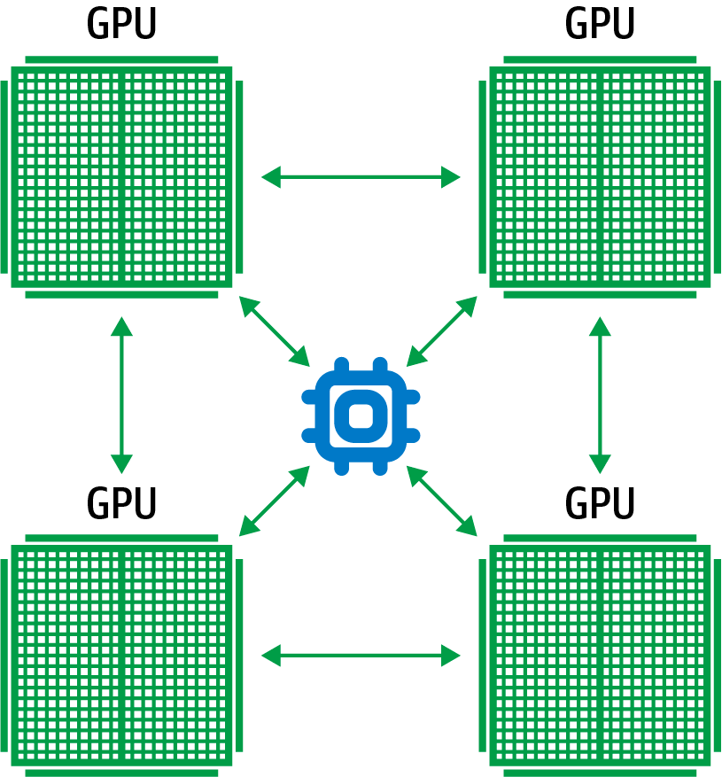
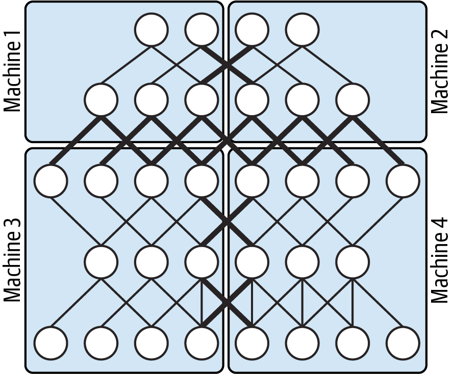
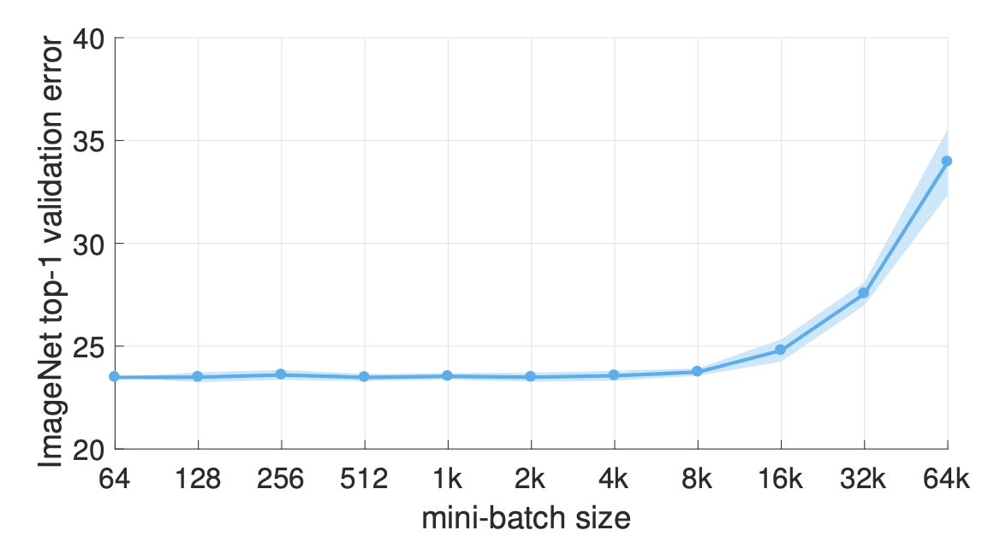
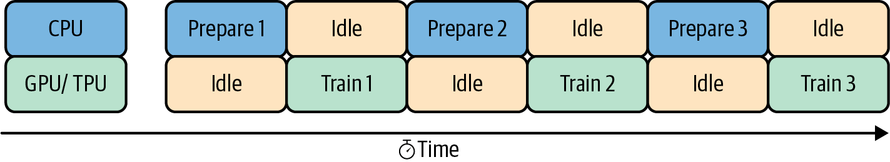
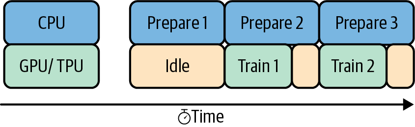
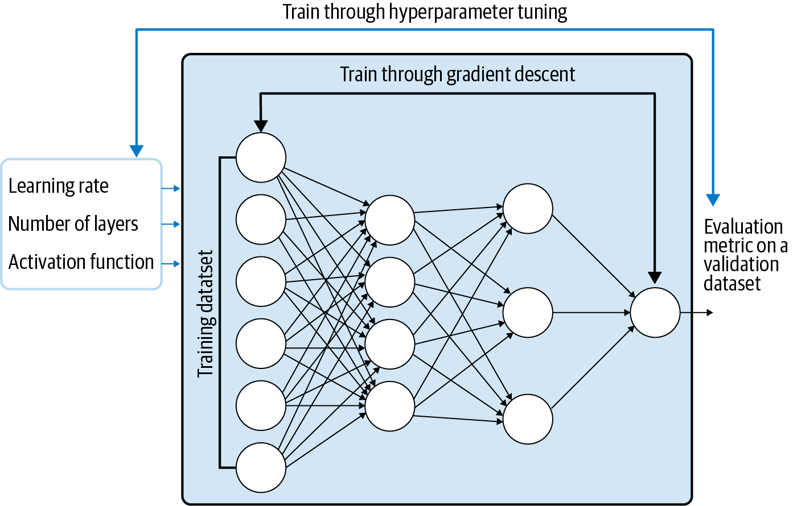

# ML-training-pattern

Source code for mentioned concepts

- Stochastic Gradient Descent: de facto optimizers
- Iteratively on small batches → Training loops → Detect if the model converge → Check overfitting (validation dataset)

Design patterns:

- [1 - Useful overfitting](##1---useful-overfitting)
- [2 - Checkpoints](##2---checkpoints)

## 1 - Useful overfitting
> Intentionally overfit on the training dataset (forgo the use of a validation/testing dataset)

**Problem**
- Use case: simulate the behavior of physical/dynamical system
- Entire domain space of observations can be tabulated (no "unseen" data that need to be generalized)

**Solution**
- ML approximation close-enough to the original solution by classical methods
- Why it works? -> `Uniform Approximation Theorem`: any functions (and derivatives) can be approximated by a NN with at least one hidden layers and any "squashing" activation function (sigmoid) → No matter what function we are given, as long as it's well behaved - no noise, no unseen behavior → There exists a NN approximate as closely as we want

**Other notes**
- Look-up table is too large → ML to approximate the lookup table (interpolate between entries in the lookup table)
- Distill knowledge of more complex ML to smaller models: 
  - (1) Train original label by large model 
  - (2) Train output_large instead of actual labels (simpler problem) on X by smaller model (overfitting - faithfully represent the prediction of large model): still enough capacity to represent the knowledge, not able to learn knowledge efficiently 
- Overfitting on small batch: sanity check if the model code works

## 2 - Checkpoints

**Problem**

Store full state of the model periodically, have access to partially trained model 
Problem
More complex models, larger data is needed, more tunable parameters → Model size increase, the time it takes to fit increase
Long training time → Machine failure

**Solution**

- Save the model state at the end of every epoch. Once failure happens, go back to the saved model state and restart
- What information in checkpoints but not final exported model?
    - Learning rate state
    - Stochastic behavior: dropout
    - Frequency of checkpoint: Huge size, I/O overhead
- Why it works? -> Enterprise-grade ML frameworks honor the presence of checkpoint files to support resilience and availability

Training could be break into 3 phases:
1. (a) - (c): learn high-level organization of the data
2. (c) - (e): learn details
3. (f): over-fitting

**Other notes**

- **Early stopping**: Production - continuous evaluation/model retraining → Turn on early stopping or checkpoint selection load checkpoints and compare for the best final models (choose either depends on you want to prioritize cost or accuracy)
- **Fine-tuning**: periodically retrain the model on fresh data → Not the last checkpoint but retrain few last epoch on just the fresh data

## 3 - Transfer learning

**Problem**

Custom ML models on unstructured data requires extremely datasets (not always available)

- First learn to make sense of the pixels, edges and shapes as parts of images (similar to the case of text)
- Involve particularly specialized data domain, not possible to use a general-purpose model
- Need to build a custom model using only the data we have and with the labels we care about

**Solution**

- Take model trained on the same type of data (image, text, etc.) for similar tasks (classification, object detection) -> Apply it to a specialized task, using our custom data
- Remove the last layer, freeze the weights
- Continue training on our custom dataset
- Why it works? -> CNN learning is hierarchical, first layers learn to recognize edges and shapes, next layer understand groups of edges

**Other notes**

- **Feature extraction**: use transfer learning to extract features. Freeze the weight of all layers before the bottleneck layer.
See: [Embedding design pattern - Data representation](Chap02-data-representation.md)
- **Fine tuning**: either update the weight of each layer in the pre-trained model, or just a few layer just before the bottlenecks.
- **Progressive fine-tuning**: to determine how many layers to freeze
  - Iteractively unfreeze layers after every training run to find the ideal number of layers to fine-tune
  - Work best when learning rate is low (0.001) and number of training iteration relatively small

- **Virtual epoch**
  - Situation: Difficult to keep track epoch/step of trainings (distribution, change the size of batch size, etc.)
  - Virtual epoch: number of training examples seen by the model (not number of steps)

## 4- Distribution strategy

**Problem**

When the size of data and model increases -> Take more time to iterate experiment. 
Speed up the training of these large networks?

**Solution**

The idea is to split the effort of training the model across multiple machines: (1) Data parallelism; (2) Model parallelism

- **Synchronous training**: 
  - Workers train on different slices of input data in parallel
  - *All-reduce algorithm*: Gradient values are aggregated at the end of each training step
  - *Central server holds*: the most current copy of the model parameters, and perform the gradient steps based on the gradient values from workers
  - Vulnerable to slow devices or poor network connection
  - Preferred when single host / fast device

- **Asynchronous training**: 
  - Workers train on different slices of input data independently, update model weights and parameters asynchronously, no workers waits for updates to the model from any of workers
  - *Parameter server*: manages the current values of the model weights
    - NO *All-reduce algorithm*. Update with what available -> Higher throughout (slow workers doesn't block the progression)
    - Workers send gradients to parameter serves -> Parameter server updates the model weights -> Send back the new model parameters to workers with the next mini-batch
  - Trade-off: Some split might be lost during training, difficult to keep track the epochs -> **Virtual epoch** - See: [2 - Checkpoints](##2---checkpoints)
  - No synchronization -> In practice, doesn't seem to be a problem. Large NN trained for multiple epochs, small discrepancies is neglibible at the end.
  - Preferred when low-power, unreliable workers
  - Limitation: I/O constraints

**Other notes**

- **Model parallelism**: When the model is so large, cannot fit in the memory of a single device
  - Partition parts of the networks and associated computation across multiple device
  - Each device operates over same mini-batch of data during training, carry out computation relates only to their separate components
  - Preferred when: Amount of computation per neuron is high, very large models where low latency is needed (online prediction)
- **Data parallelism**: Each device take different mini-batch, carry out same computation
  - Preferred when: Amount of computation per weight is high

- **Choose batch size**: 
  - Too small: I/O overhead, slow down the training
  - Too large: 
    - GPU memory overflow, slow down the training
    - Affect the SGD converges and quality of final solution

- Minimize I/O waits
  - GPU/TPU process data much faster than CPU. When using distributed strategies, I/O issues with bottlenecks (training steps finish, data for next steps not available)
  - CPU: handle input pipeline, reading data, processing, sending to accelerator for computation
  - GPU speeds up training (faster than the CPU input pipeline) -> Not fully utilize the computing power
  
  

  - Solutions:
    - Use optimized file format (`TFRecords`) handle large amount of data more efficiently 
    - Overlap the preprocessing and model execution (computation): `prefetch` when the model executes training step N, input pipeline is reading/preparing data for step N + 1

## 5 - Hyperparameter tuning

**Problem**

- Find the best Hyperparameters (HP) for the model
- Grid search and combinatorial explosion: 
  - Grid search: try every combination of specified value -> Too many combinations
  - Not all combinations are useful
  - Not all combinations are valid
  - Combinatorial explosion: quickly become expensive for models. Significant training time, large HP search space.

**Solution**
- HP tuning as an outer optimization loop, model training is the inner loop
  - Inner loop (each loop = 1 step of training, miliseconds): differentiable, search for optimal parameters by SGD 
  - Outer loop (each loop = 1 single trials, complete model, hours): nonlinear optimization 
- **Bayesian optimization**: 
  - Start with a small set of random values
  - Evaluate the performance of the model with these values
  - Use the results to build a probability distribution of the performance of the model
  - Use the probability distribution to select the next set of values to try
  - Repeat until the probability distribution is narrow enough

**Other notes**
- Beside, tuning to select the best model, HP framework can be used to generate a family of models that can act as ensemble
- Fully managed HP tunning: multiple trials in parallel (GCP, AWS SageMaker), config:
  - HP to tune, and the range
  - Optimization metric
  - Strategies
- Alternative genetic algorithms: "survival of the fittest", better than gird/random search, though with large search space, complexity increases
  - Define fitness function
  - Randomly select a few combinations of HPs in search space, run trial
  - Take HP of the best trial to define the new search space
  - (Repeat)