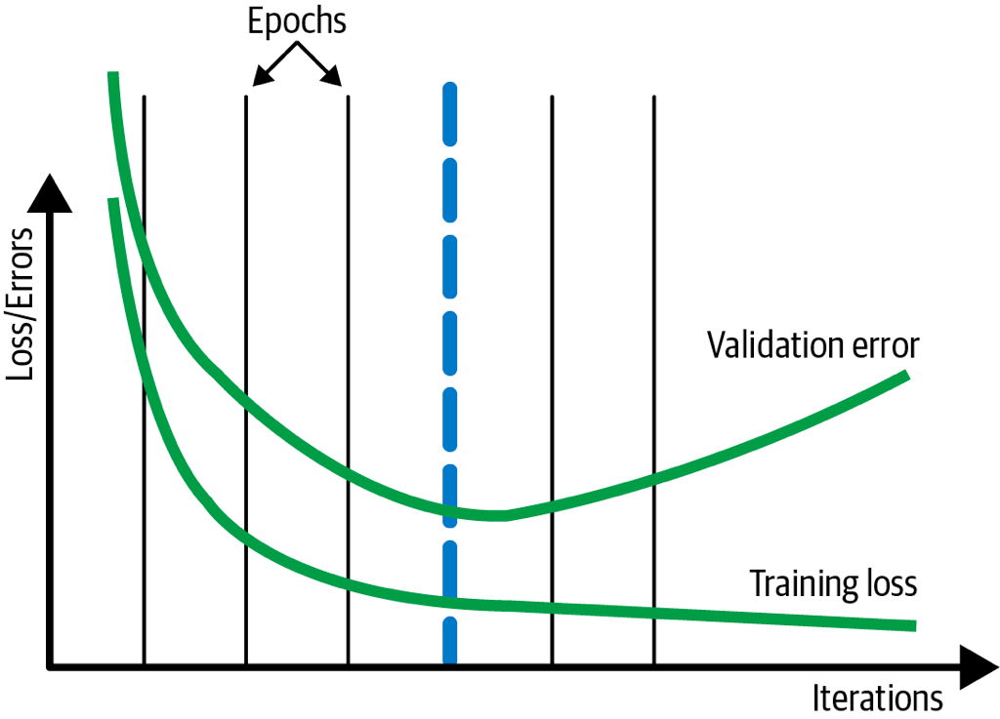

# ML-training-pattern
- Stochastic Gradient Descent: de facto optimizers
- Iteratively on small batches → Training loops → Detect if the model converge → Check overfitting (validation dataset)

## Useful overfitting
> Intentionally overfit on the training dataset (forgo the use of a validation/testing dataset)
Problems
- Use case: simulate the behavior of physical/dynamical system
- Entire domain space of observations can be tabulated (no "unseen" data that need to be generalized)
- ML approximation close-enough to the original solution by classical methods
Also useful for other cases:
- Look-up table is too large → ML to approximate the lookup table (interpolate between entries in the lookup table)
- Distill knowledge of more complex ML to smaller models: (1) Train original label by large model → (2) Train output_large instead of actual labels (simpler problem) on X by smaller model (overfitting - faithfully represent the prediction of large model): still enough capacity to represent the knowledge, not able to learn knowledge efficiently 
- Overfitting on small batch: sanity check if the model code works
Why it works?
- Uniform Approximation Theorem: any functions (and derivatives) can be approximated by a NN with at least one hidden layers and any "squashing" activation function (sigmoid) → No matter what function we are given, as long as it's well behaved - no noise, no unseen behavior → There exists a NN approximate as closely as we want

## Checkpoints

Problem
Store full state of the model periodically, have access to partially trained model 
Problem
More complex models, larger data is needed, more tunable parameters → Model size increase, the time it takes to fit increase
Long training time → Machine failure

**Solution**

- Save the model state at the end of every epoch. Once failure happens, go back to the saved model state and restart
- What information in checkpoints but not final exported model?
	- Learning rate state
	- Stochastic behavior: dropout
	- Frequency of checkpoint: Huge size, I/O overhead
> Example: model training processes

Training could be break into 3 phases:
1. (a) - (c): learn high-level organization of the data
2. (c) - (e): learn details
3. (f): over-fitting

Use cases

- **Early stopping**: Production - continuous evaluation/model retraining → Turn on early stopping or checkpoint selection load checkpoints and compare for the best final models (choose either depends on you want to prioritize cost or accuracy)
- **Fine-tuning**: periodically retrain the model on fresh data → Not the last checkpoint but retrain few last epoch on just the fresh data

