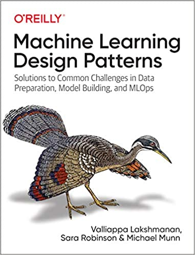

## ML Design Patterns

Authors: Valliappa Lakshmanan, Sara Robinson, Michael Munn

Published by O'Reilly Media

Source: https://learning.oreilly.com/library/view/machine-learning-design/9781098115777

## Reading group: Covered contents
1. [Chap02-data-representation.md](Chap02-data-representation.md)
2. [Chap04-model-training.md](Chap04-model-training.md)

Source code

